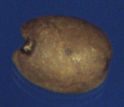
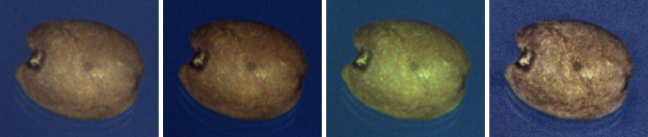

## training_callbacks.py

This file contains the code for the training callbacks.
As a machine learning engineer, I often need to train several models at once, therefore keeping track of the best models and their parameters such as accuracy, loss, etc. is quite challenging for me.
the callbacks I used and coded in the file helped me in my job.

the callbacks checkpoint, tensorboard, reduce_lr are often used by many people. However, the callback I coded named "SaveBestAccuracyCallback" is not that common and is a good addition to the training process.

## augmentations.py
This file contains some helpful functions to augment images.
### original image

### output of functions

